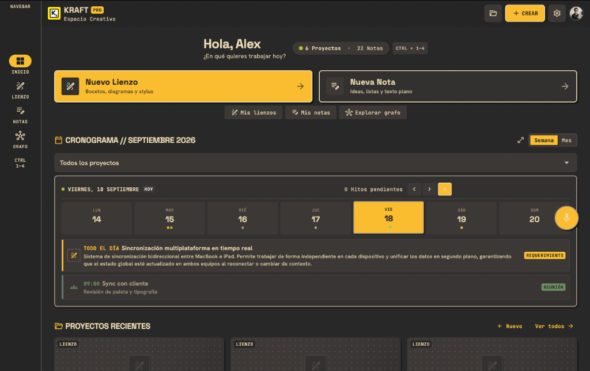
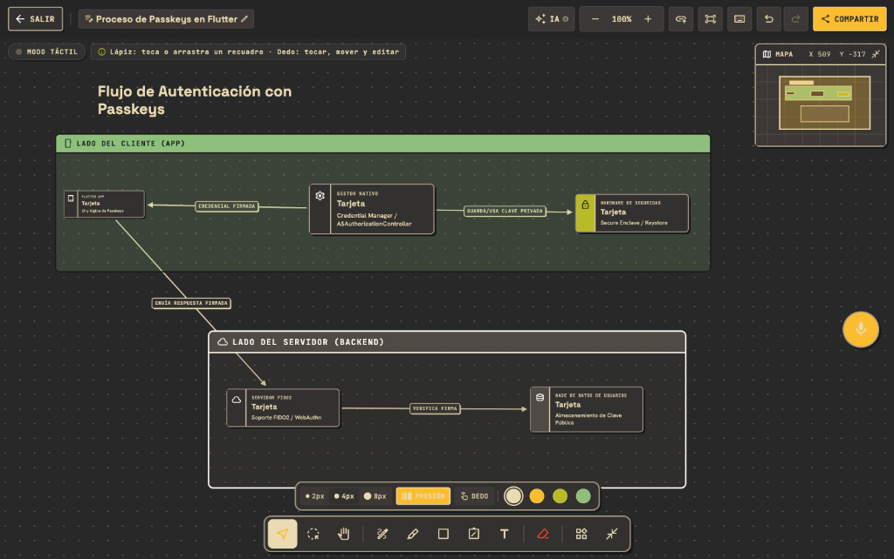
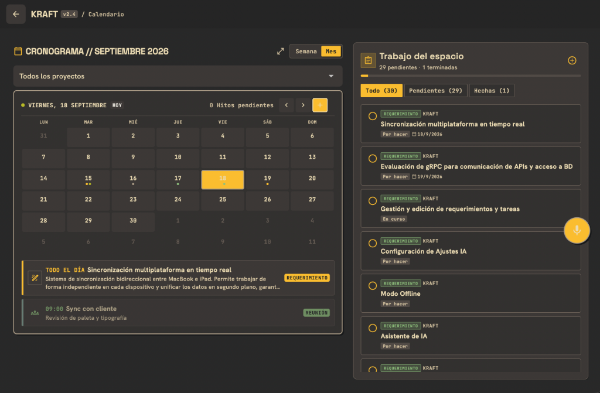
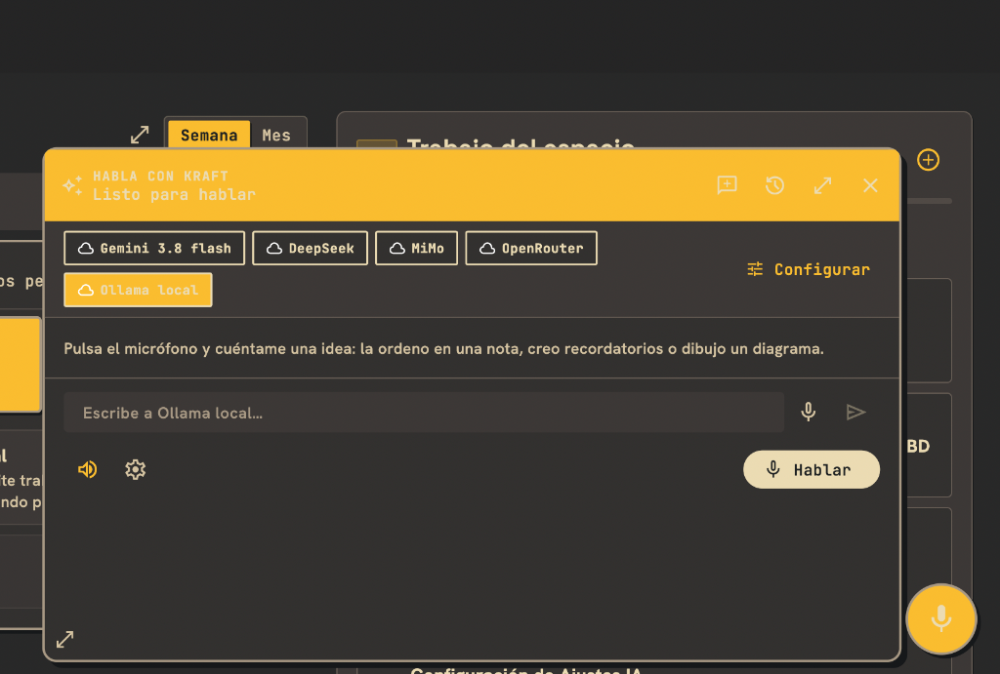

<div align="center">

# ⚡️ KRAFT

**Local-first creative workspace for macOS and iPadOS**  
*Projects • Infinite Canvas • Calendar Planning • Markdown Notes • Multi-Model AI*

[](https://github.com/Arbenidas/kraft-app/releases/latest)
[](https://opensource.org/licenses/MIT)
[](https://flutter.dev)
[](https://github.com/Arbenidas/kraft-app)

<br/>

[](https://github.com/Arbenidas/kraft-app/releases/latest)

<br/><br/>



</div>

> **Notice**: KRAFT is in active development. Data stays local on your device (SQLite); cloud sync is coming in future releases.

---

## ✨ Features

### 🗂️ Unified Workspace & Project Management
Organize complex ideas into actionable roadmaps. Manage projects, multi-level requirements, acceptance criteria, and subtasks in one clear hierarchy.

### 🎨 Infinite Canvas
Freely draw, connect diagrams, map workflows, and brainstorm with an infinite 2D canvas supporting stylus, pressure sensitivity, and Apple Pencil gestures.

<div align="center">
  
</div>

### 📅 Calendar Planning & Matrix
Weekly and monthly calendar with drag-and-drop scheduling, milestone tracking, and daily task management.

<div align="center">
  
</div>

### 🤖 Intelligent Assistant & MCP Server
Interact naturally using voice dictation or chat. Connect local and cloud models (**Gemini**, **DeepSeek**, **Ollama local**, **OpenRouter**) or control KRAFT from **Claude Desktop / Cursor** via the built-in Model Context Protocol (MCP) server.

<div align="center">
  
</div>

---

## 🚀 Installation & Downloads

### macOS
1. Download `kraft-macos-v0.1.0.zip` from [GitHub Releases](https://github.com/Arbenidas/kraft-app/releases/latest).
2. Unzip the file and move `kraft.app` into your `/Applications` folder.
3. **First launch note (macOS Gatekeeper):**  
   Right-click (or Control-click) `kraft.app` and choose **Open**, then confirm by clicking **Open**.  
   *(Or run `xattr -cr /Applications/kraft.app` in Terminal to clear quarantine).*

### iPadOS
Building for iPad requires Xcode and an Apple Developer account, or sideloading via TestFlight/AltStore.

---

## 🔒 Privacy and Local-first
- **Zero remote telemetry:** Your workspace data is stored in a local SQLite database (`drift`).
- **Secure Credentials:** API keys for external models (Gemini, OpenRouter, etc.) are stored in the macOS Keychain / iOS Secure Enclave and are never committed to this repository.
- **Offline Capable:** Full functionality without internet access (using local Ollama models or canvas/notes offline).

---

## 🛠️ Development Setup

### Requirements
- Flutter 3.47 or newer (Dart 3.10+)
- Xcode for macOS and iPadOS builds
- An iPad simulator/device or a Mac for development

### Getting started

```bash
git clone https://github.com/Arbenidas/kraft-app.git
cd kraft-app
flutter pub get
flutter run -d macos
```

To target a connected device or simulator:

```bash
flutter devices
flutter run -d <device-id>
```

### Quality checks

```bash
dart format --output=none --set-exit-if-changed lib test packages
flutter analyze --no-fatal-infos
flutter test
```

Drift generated code must be refreshed after modifying `lib/data/db/tables.dart`:

```bash
dart run build_runner build --delete-conflicting-outputs --force-jit
```

When the database schema changes, increment `schemaVersion` and add the corresponding migration in `lib/data/db/database.dart`.

---

## 📁 Project layout

```text
lib/
  app/          Routing and application shell
  data/         Drift/SQLite database, repositories and Riverpod providers
  features/     Product features: projects, notes, canvas, calendar, AI and settings
  platform/     Native-platform bridges
  theme/        Design tokens and theme controllers
  widgets/      Shared UI components
packages/
  kraft_web_discovery/  Experimental, replaceable public HTML search adapter
test/           Unit and widget tests
docs/           Product and implementation notes
```

---

## 🔌 MCP (Model Context Protocol)

KRAFT can expose a local MCP endpoint from **Connect AI** in the app. It uses a bearer token and is intended for trusted local networks.

The MCP tool set can read and manage projects, requirements, subtasks, notes, and canvases. It can also request opening or closing a current KRAFT view when the app is active.

---

## 🤝 Contributing

Contributions are welcome. Read [CONTRIBUTING.md](CONTRIBUTING.md) before opening an issue or pull request, and follow the [Code of Conduct](CODE_OF_CONDUCT.md).

For security issues, use the process in [SECURITY.md](SECURITY.md) instead of public issue comments.

---

## 📄 License

KRAFT is available under the [MIT License](LICENSE).
