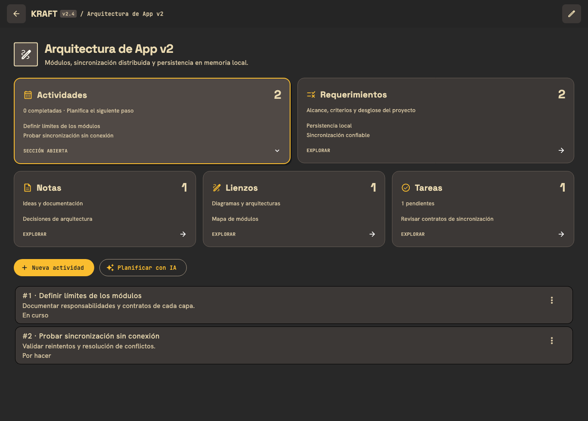
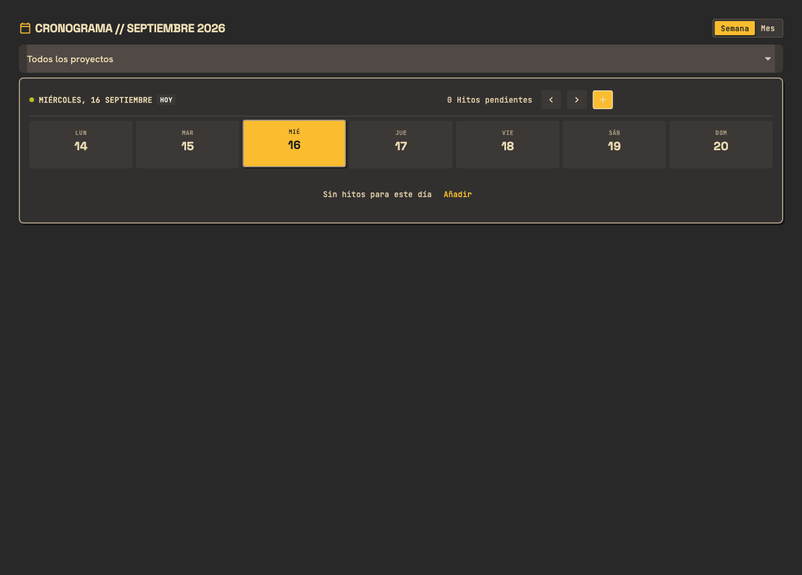

# Creación con IA y vista de proyectos

La vista de proyecto muestra Actividades, Requerimientos, Notas, Lienzos y Tareas como un bento. Cada tarjeta tiene cantidad, resumen y hasta dos elementos de vista previa. Al seleccionarla se abre su contenido debajo. En escritorio hay dos tarjetas grandes arriba y tres abajo; en pantallas estrechas pasan a dos o una columna. La selección pertenece a cada proyecto.

## Usar Gemini Live con más razonamiento

En **Ajustes → Asistente → Modelo de voz en tiempo real**, selecciona **Gemini 3.8 Live · piensa más**. La siguiente conversación utiliza `gemini-3.8-live-extended-thinking` con razonamiento `HIGH`, declaraciones de herramientas `NON_BLOCKING` y el endpoint WebSocket `v1alpha` documentado para esta integración. Se conserva la elección anterior del usuario: no se cambia automáticamente de modelo.

La interfaz distingue el final de una frase de voz del final de la interacción. Mientras Gemini informa `IN_PROGRESS` sigue mostrando que piensa/revisa; `IDLE` termina esa fase. Una actualización hablada no se presenta como trabajo completado.

La variante estándar `gemini-3.8-live` mantiene su configuración sin `thinkingConfig`, porque no admite profundidad configurable. [Documentación oficial de Google](https://ai.google.dev/gemini-api/docs/live-api/thinking).

## Qué cambia al crear

Live, chat, DeepSeek, MiMo y la IA local reciben criterios de creación: leer el contenido existente, plantear un plan breve cuando sea necesario, distinguir hechos y propuestas, ejecutar cambios dependientes en orden y comprobar lo guardado. Las instrucciones no exigen cantidades arbitrarias de palabras o nodos. La versión compacta conserva estos criterios con menos contexto para el modelo local.

Las arquitecturas deben expresar responsabilidades, límites, entradas/salidas y relaciones claras. Los requerimientos deben tener descripción y criterios comprobables; los hijos se vinculan con `parent_id`. Las herramientas buscan proyectos y permiten asociar notas, lienzos y tareas a un `project_id` válido.

`review_artifact` revisa una nota, un lienzo o las actividades/requerimientos de un proyecto:

- Detecta notas o lienzos vacíos; reconoce notas que contienen un dibujo sin texto.
- Detecta tarjetas sin título, conexiones huérfanas y conexiones sin etiqueta.
- Señala posibles duplicados y elementos de planificación sin descripción o requerimientos sin criterios de aceptación.
- Devuelve hasta veinte errores y veinte advertencias, junto con sus totales, para limitar el contexto.

Esta revisión comprueba estructura. No certifica la exactitud del contenido ni demuestra que el modelo haya satisfecho todos los objetivos: se le pide también releer el resultado y contrastarlo con la solicitud.

Las llamadas de Live se ejecutan en orden. Un id de llamada repetido no se ejecuta otra vez. Las llamadas canceladas pendientes se omiten y los resultados de sesiones anteriores no se envían a una sesión nueva. Cancelar no revierte cambios que una herramienta ya haya realizado.

## Corrección de la franja amarilla

El selector «Todos los proyectos» tiene un Material propio, recorte y colores neutros de foco/hover. Cada rama de navegación contiene sus efectos de tinta, y las ramas ocultas excluyen el foco. Así esos efectos no quedan pintados en otra pantalla.

## Validación

Se aprobaron 131 pruebas de la suite completa. Incluyen bento y adaptación a pantalla estrecha, aislamiento de foco, configuración compatible de Live estándar/Thinking, estados de interacción, llamadas duplicadas/canceladas, revisión de artefactos y asociación con proyectos. Se revisaron renders del bento en claro y oscuro, en pantalla estrecha y del calendario enfocado en oscuro.

No se evaluó la calidad de generación mediante una conversación real con Gemini ni una sesión real de inferencia local. Las pruebas de transporte simulado verifican el cliente y sus herramientas; no verifican disponibilidad del modelo para la cuenta, cuota, latencia ni calidad de razonamiento.
